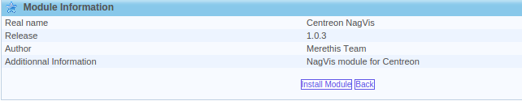
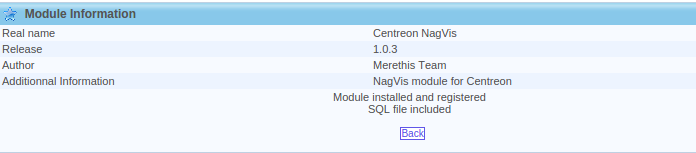

Centreon NagVis module
======================

This module will:

* add a menu item in *View > Nagvis* displaying a page listing available maps (located in */usr/local/nagvis/etc/maps*) in a select form
* handle authentication in a simple way, so that users can see the maps, without having to log in Centreon and in NagVis again

Install the module either by getting the source on the forge or using RPM through the YUM repository of CES.

.. warning::

 Follow the procedures under «root» privileges.

Install for Centreon Enterprise Server
--------------------------------------

If your platform is based on "Centreon Enterprise Server", you just have to install the Centreon-Nagvis Package :

::

 # yum install centreon-nagvis

Package install
---------------

Packages are provided by MERETHIS and are available on the download Web platform.

You have to extract the archives on you centreon module directory.

::

 # tar xzf centreon-nagvis-1.0.3.tar.gz

Web install
-----------

The next step of the installation of the module is to be done through the Web user interface of Centreon. Navigate to the module management page :

::

 Administration > Modules

Click on the installation icon of the « centreon-nagvis » module : |add|

.. |add|	image:: ../_static/Install_web_1.png
