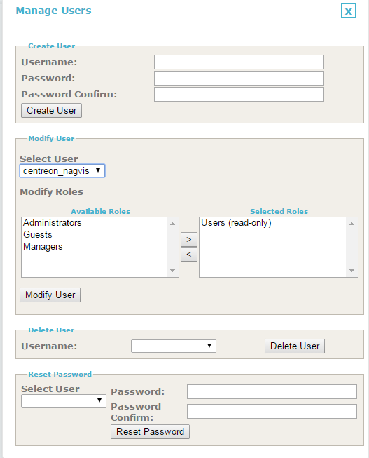

Centreon NagVis module
======================

This module will:

* add a menu item in *View > Nagvis* displaying a page listing available maps (located in */usr/local/nagvis/etc/maps*) in a select form
* handle authentication in a simple way, so that users can see the maps, without having to log in Centreon and in NagVis again

Install the module either by getting the source on the forge or using RPM through the YUM repository of CES.

Install for Centreon Enterprise Server
--------------------------------------

If your platform is based on "Centreon Enterprise Server", you just have to install the Centreon-Nagvis Package :

::

 # yum install centreon-nagvis

Package install
---------------

Packages are provided by MERETHIS and are available on the download Web platform.

.. warning::

 Follow the procedure under «root» privileges.

You have to extract the package on the correct directory

Web install
-----------

The next step of the installation of the module is to be done through the Web user interface of Centreon. Navigate to the module management page :

::

 Administration > Modules

Click on the installation icon of the « centreon-nagvis » module :

.. image:: ../_static/Install_web_1.png
    :width: 0.3228in
    :height: 0.2193in

.. image:: ../_static/Install_web_2.png
    :width: 6.3957in
    :height: 1.3862in

.. image:: ../_static/Install_web_3.png
    :width: 6.5937in
    :height: 1.7083in

After installation, you can activate the module on Centreon web interface *Administration > Modules*

Check default NagVis location in *Administration > Nagvis* (*/usr/local/nagvis/share*).

Add a new "centreon_nagvis" user in NagVis administration (this will populate */usr/local/nagvis/etc/auth.db* accordingly, which is the SQLite DB used by NagVis).
Grant him the "Users (read only)" role.

Edit */usr/local/nagvis/share/server/core/defines/global.php*:

::

  # Default value
  # define('SESSION_NAME', 'nagvis_session');
  define('SESSION_NAME', 'PHPSESSID');

This is needed to "share" cookie with Centreon.

You should now be able to display NagVis maps in Centreon.

.. warning:: 
  Once integrated in Centreon, there is this light SSO between Centreon and NagVis using "centreon_nagvis" NagVis user.

  If you want to edit maps, you'll need to access directly *http://ip_of_centreon_server/nagvis*, log out as centreon_nagvis, log in as admin then edit/create maps.

  Make sure you click on *Edit Map > Lock/Unlock all* to switch in edit mode, and ensure you do the same once map are finished to leave editing mode.

  This will ensure you do NOT see maps in edit mode in Centreon (popup do not appear on mouse over).

