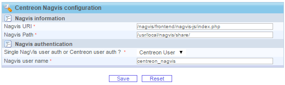
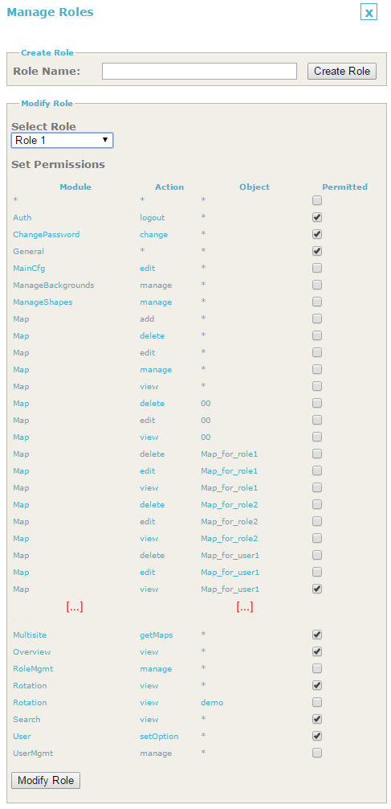
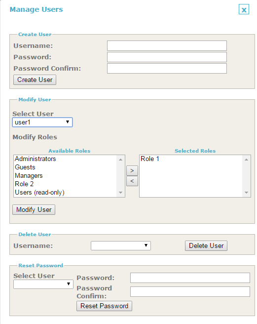
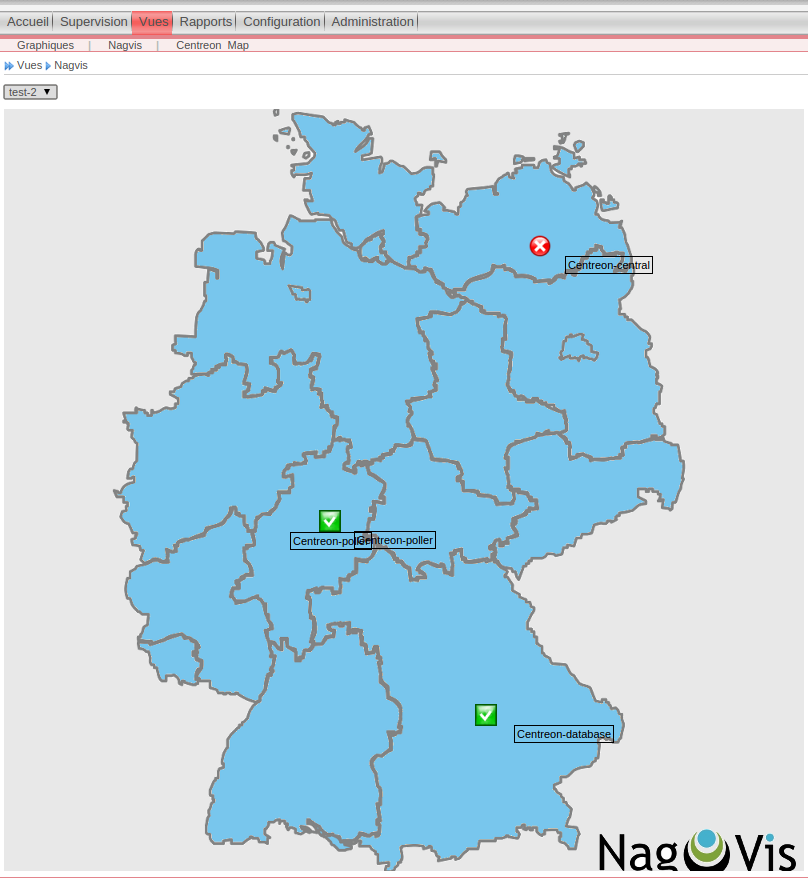

User guide
==========

Options
----------

Check default NagVis options in *Administration > Nagvis* (*/usr/local/nagvis/share*).

Option description:

* *Nagvis URI*: NagVis path to the NagVis frontend scripts, loaded from the browser to display maps
* *Nagvis Path*: NagVis path on the Centreon server, code in loaded in the backend
* *Single NagVis user auth or Centreon user auth*: NagVis authentication mode used by Centreon to get maps (see below)
* *Nagvis user name*: NagVis path on the Centreon server, code in loaded in the backend

NagVis authentication
----------------------

Centreon needs to authenticate on NagVis to get the list of maps that is displayed when you go in *View > Nagvis*

There are 2 ways Centreon can authenticate on NagVis, as defined with *Single NagVis user auth or Centreon user auth* option:

* *single user*: in this mode, Centreon will use the same NagVis account for all Centreon users connected, this is the simplest mode, every Centreon users will get the same list of maps ; Centreon will use the NagVis account specified with *Nagvis user name* ("centreon_nagvis" by default)
* *Centreon user*: in this mode, Centreon will use the login of the connected user in Centreon to authenticate in NagVis ; this requires that a Centreon user have a NagVis account with the same name

.. note::

When listing maps, Centreon will properly handle permissions on maps. So with *Centreon user* authentication, it is possible to assign individual permissions on maps, so that each user only sees its maps.

.. warning::

With *Centreon user*, there is no need to create in NagVis the user specified in *Nagvis user name* whereas it is mandatory with *single user*

User management in NagVis
------------------------------------------------

First you need to add either a single user ("centreon_nagvis" by default) or Centreon users in NagVis through the administration forms (this will populate */usr/local/nagvis/etc/auth.db* accordingly, which is the SQLite DB used by NagVis).

To create a user, fill in the first field set then click on "Create User".

.. image:: _static/centreon_nagvis.png

If you are using a single user for all Centreon users, the easiest setup is to grant him the "Users (read only)" role so that this user has access to all maps.

But you can configure users to only have access to some maps by defining a new role, like "Role1" in the example below.

Then you can grant this role to a user like "user1"

.. warning::

Make sure permissions are properly setup in NagVis.
You must first be able to log in as this new user in NagVis and see the maps in NagVis. As long as this does not work, Centreon will never be able to display maps correctly.

Authentication setup between Centreon and NagVis
------------------------------------------------

Edit */usr/local/nagvis/share/server/core/defines/global.php*:

::

  # Default value
  # define('SESSION_NAME', 'nagvis_session');
  define('SESSION_NAME', 'PHPSESSID');

This is needed to "share" cookie with Centreon.

You should now be able to display NagVis maps in Centreon.

.. warning:: 
  Once configured, this acts as a kind of light SSO between Centreon and NagVis.

If you want to edit maps:
 
* Access directly on *http://ip_of_centreon_server/nagvis*

* Log out as the current user and switch to admin user to edit/create maps.

.. note::

 Make sure you click on *Edit Map > Lock/Unlock all* to switch in edit mode, and ensure you do the same once map are finished to leave editing mode.
 
 This will ensure you do NOT see maps in edit mode in Centreon (popup do not appear on mouse over).

